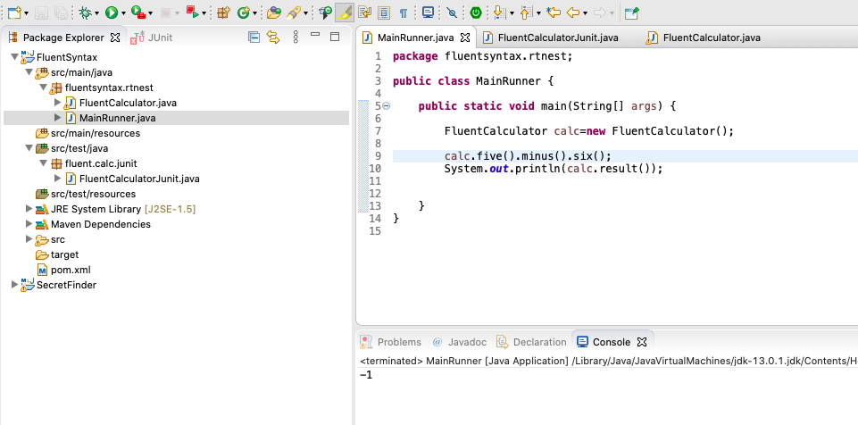
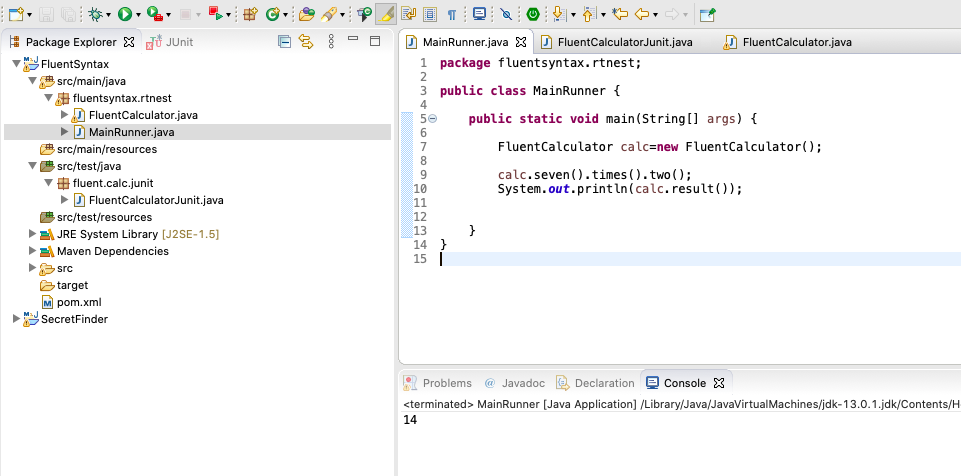

## Question 2:​ The goal is to implement simple calculator which uses fluent syntax: 
```
Calc.new.one.plus.two # Should return 3 
Calc.new.five.minus.six # Should return -1 
Calc.new.seven.times.two # Should return 14 
Calc.new.nine.divided_by.three # Should return 3
```
### 1. Results for case 1


### 2. Result for Case 2 


### 3. Results for case 3


### 4. Results for case 4

