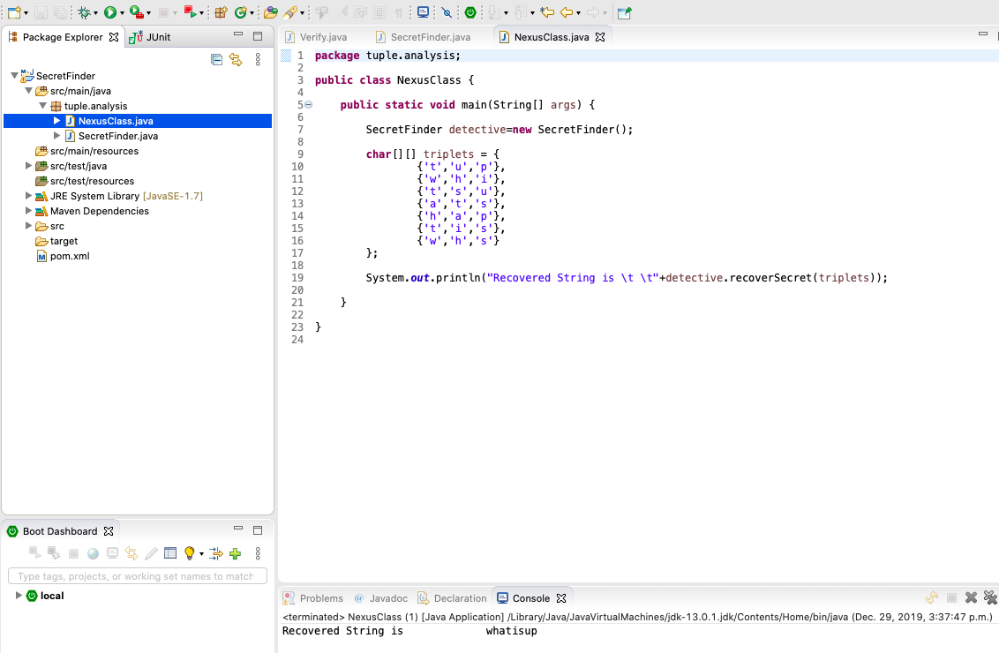
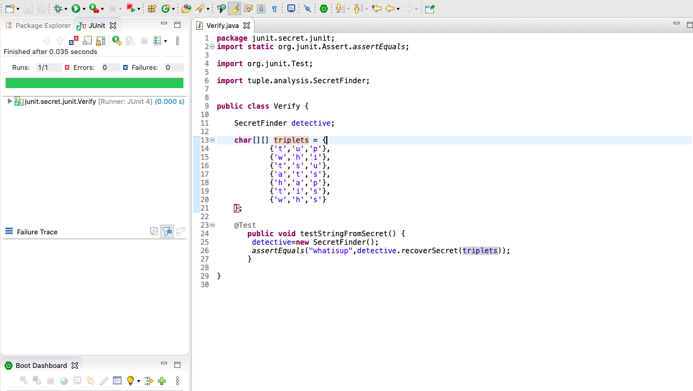

## Question 1:​ There is a secret string which is unknown to you. Given a collection of random triplets from the string, recover the original string.
A triplet here is defined as a sequence of three letters such that each letter occurs somewhere before the next in the given string. ['w', 'h', 'i'] is a triplet for the string 'whatisup'.
As a simplification, you may assume that no letter occurs more than once in the secret string.
You can assume nothing about the triplets given to you other than that they are valid triplets and that they contain sufficient information to deduce the original string. In particular, this means that the secret string will never contain letters that do not occur in one of the triplets given to you.

```
#secret="whatisup"
triplets ​= ​
[ 	[​'t'​,​'u'​,​'p'​],
	[​'w'​,​'h'​,​'i'​], 
	[​'t'​,​'s'​,​'u'​],
 	[​'a'​,​'t'​,​'s'​],
 	[​'h'​,​'a'​,​'p'​],
 	[​'t'​,​'i'​,​'s'​],
 	[​'w'​,​'h'​,​'s'​] 
]
```
### Result 1: Image showing retrieved secret value from Tuple ###



### Result 2: Image showing Junit test to verify the result ###

